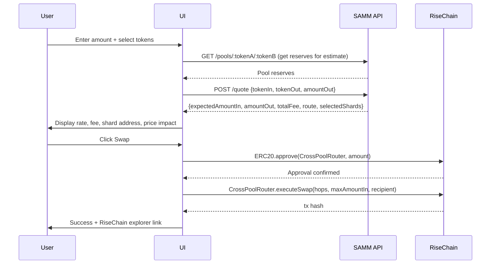
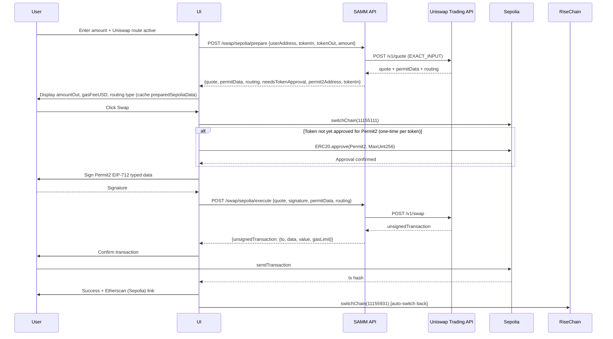
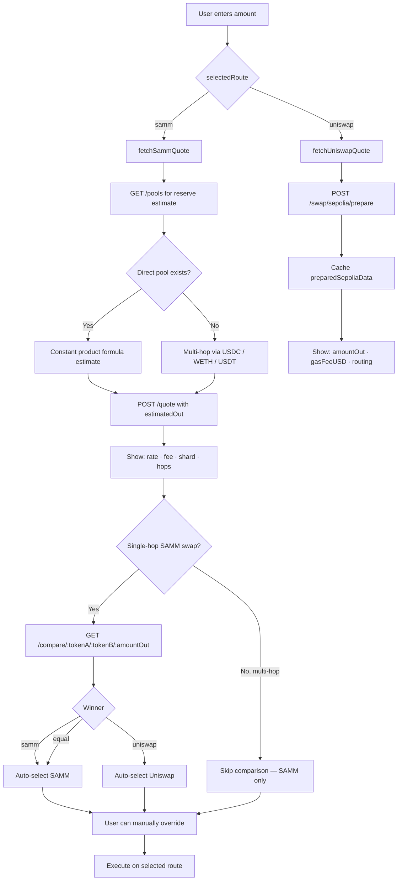
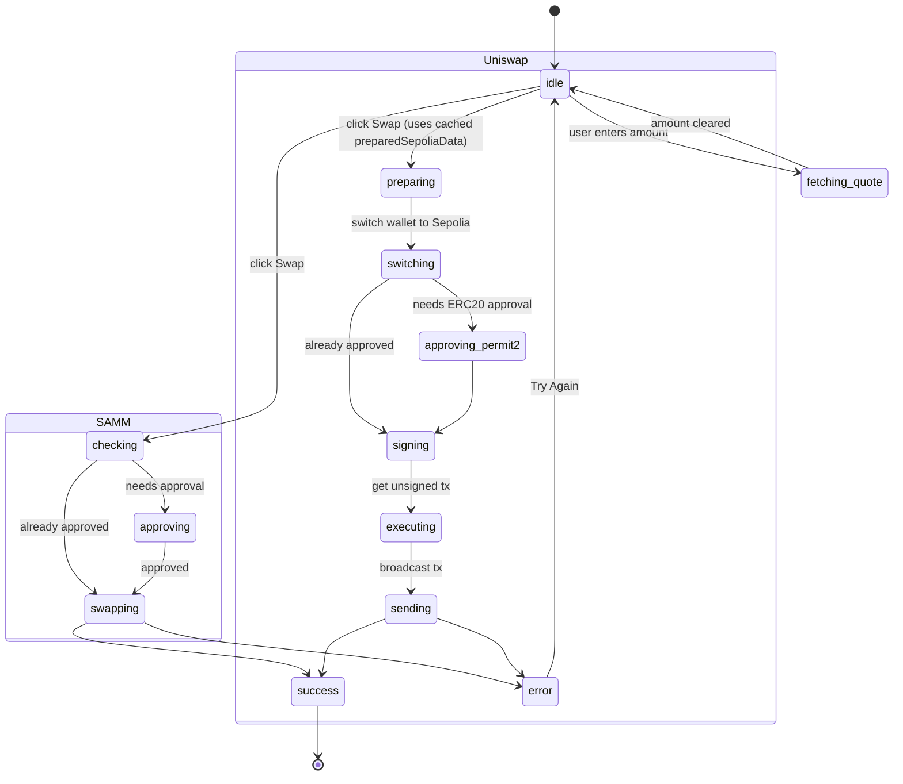

# SAMM DEX — Frontend

> **Sharded Automated Market Maker** 

---

## What is SAMM?

SAMM is a DEX that shards liquidity across multiple on-chain pools (shards) for the same token pair, optimizing capital efficiency. Each shard operates as an independent AMM pool. The router selects the best shard(s) and routes trades across them, supporting both single-hop (direct) and multi-hop swaps.

When SAMM has no liquidity or Uniswap offers a better rate, the frontend automatically routes the swap through **Uniswap on Sepolia** using the Uniswap Trading API with Permit2 gasless approvals.

---

## Architecture Overview

```
┌──────────────────────────────────────────────────────────┐
│                    Browser (React 18)                    │
│                                                          │
│  ┌─────────────┐  ┌──────────────┐  ┌───────────────┐   │
│  │EnhancedSwap │  │  PoolsPage   │  │ PortfolioPage │   │
│  │    Card     │  │              │  │               │   │
│  └──────┬──────┘  └──────┬───────┘  └───────┬───────┘   │
│         │                │                  │            │
│  ┌──────▼──────────────────────────────────▼───────┐    │
│  │              NetworkContext (shared state)       │    │
│  │   selectedRoute: 'samm' | 'uniswap'             │    │
│  │   availableNetworks: [RiseChain, Sepolia]        │    │
│  └──────────────────────┬──────────────────────────┘    │
│                         │                                │
│  ┌──────────────────────▼──────────────────────────┐    │
│  │              sammApi.ts (HTTP client)            │    │
│  └──────────────────────┬──────────────────────────┘    │
└─────────────────────────┼────────────────────────────────┘
                          │
          ┌───────────────▼───────────────┐
          │    SAMM API Server (:3000)    │
          │    (Node.js / Express)        │
          ├───────────────────────────────┤
          │  RiseChain RPC               │
          │  Uniswap Trading API         │
          │  ENS Registry                │
          └───────────────────────────────┘
```

---

## Swap Routes

The app supports two swap routes, selected automatically based on best rate (user can override).

### Route 1 — SAMM (RiseChain Testnet)

- Chain ID: `11155931`
- RPC: `https://testnet.riselabs.xyz/http`
- Uses the CrossPoolRouter contract to route through SAMM shards
- Supports 8 tokens: WETH, WBTC, USDC, USDT, DAI, LINK, UNI, AAVE
- Exact-output quote model: backend calculates `amountIn` given desired `amountOut`

### Route 2 — Uniswap (Sepolia Testnet)

- Chain ID: `11155111`
- Uses official Uniswap Trading API via the backend proxy
- Supports 6 tokens: ETH, WETH, USDC, USDT, DAI, LINK
- Gasless approvals via Permit2 (EIP-712 typed data signing)

---

## Flow Diagrams

### SAMM Quote & Swap Flow



### Uniswap Quote & Swap Flow (Permit2)



### Route Comparison & Auto-Selection



### Swap Card State Machine



---

## Tech Stack

| Layer | Technology |
|---|---|
| Framework | React 18, TypeScript, Vite |
| Styling | Tailwind CSS, shadcn/ui |
| Web3 | Wagmi v2, Viem, RainbowKit |
| Data fetching | TanStack Query (React Query) |
| Wallet support | MetaMask, Rainbow, WalletConnect, Coinbase, Injected |
| RPC (RiseChain) | `https://testnet.riselabs.xyz/http` (Alchemy override via env) |
| RPC (Sepolia) | Alchemy `eth-sepolia.g.alchemy.com` |

---

## Quick Start

```bash
# 1. Install dependencies
npm install

# 2. Configure environment
cp .env.example .env.local
# Required: VITE_WALLETCONNECT_PROJECT_ID, VITE_ALCHEMY_API_KEY

# 3. Start the SAMM backend (separate terminal)
cd ../samm-evm && node api-server.js   # runs on :3000

# 4. Start the frontend dev server
npm run dev   # http://localhost:8080
```

### Environment Variables

| Variable | Required | Description |
|---|---|---|
| `VITE_WALLETCONNECT_PROJECT_ID` | Yes | 32-char WalletConnect project ID |
| `VITE_ALCHEMY_API_KEY` | Recommended | Reliable RPC for all chains |
| `VITE_API_URL` | No | Backend URL (default: `http://localhost:3000`) |
| `VITE_RISECHAIN_RPC_URL` | No | Override RiseChain RPC |
| `VITE_COINGECKO_API_KEY` | No | Token price data |

### Commands

```bash
npm run dev        # Dev server on :8080
npm run build      # Production build
npm run lint       # ESLint
npm run preview    # Preview production build
```

---

## Key Backend Endpoints

| Method | Endpoint | Used for |
|---|---|---|
| `POST` | `/quote` | SAMM exact-output swap quote |
| `GET` | `/pools/:tokenA/:tokenB` | Pool reserves for estimation |
| `GET` | `/compare/:tokenA/:tokenB/:amountOut` | SAMM vs Uniswap rate comparison |
| `GET` | `/balances/:address` | RiseChain token balances |
| `POST` | `/swap/sepolia/prepare` | Uniswap quote + Permit2 data |
| `POST` | `/swap/sepolia/execute` | Uniswap unsigned transaction |
| `GET` | `/registry/shards` | ENS-based shard/pool registry |
| `GET` | `/stats` | DEX stats (TVL, pools, pairs) |
| `GET` | `/health` | API health check |

---

## Token Support

### RiseChain Testnet (SAMM route)
WETH · WBTC · USDC · USDT · DAI · LINK · UNI · AAVE

### Sepolia Testnet (Uniswap route)
ETH · WETH · USDC · USDT · DAI · LINK

---

## Pages

| Route | Description |
|---|---|
| `/` | Swap interface — SAMM and Uniswap routing |
| `/pools` | All SAMM liquidity pools with ENS names, TVL, reserves |
| `/portfolio` | Wallet LP positions and token balances |
| `/history` | On-chain transaction history |

---

## Project Structure

```
rise-samm-gui/
├── src/
│   ├── components/
│   │   ├── EnhancedSwapCard.tsx   # Main swap UI (SAMM + Uniswap)
│   │   ├── Header.tsx             # Network selector, wallet, theme
│   │   ├── TokenInput.tsx         # Amount input with balance display
│   │   ├── TokenSelectModal.tsx   # Token picker
│   │   └── ui/                    # shadcn/ui primitives
│   ├── config/
│   │   ├── chains.ts              # RiseChain + Sepolia chain definitions
│   │   ├── tokens.ts              # Token list per chain (keyed by chainId)
│   │   ├── contracts.ts           # CrossPoolRouter addresses
│   │   └── web3.ts                # Wagmi config + wallet connectors
│   ├── contexts/
│   │   └── NetworkContext.tsx     # selectedRoute + availableNetworks (global)
│   ├── hooks/
│   │   ├── useBatchSwap.ts        # Approve + swap in sequence (SAMM)
│   │   ├── useTokenBalance.ts     # On-chain balance reads
│   │   ├── useTokenPrice.ts       # CoinGecko price feeds
│   │   ├── useComparison.ts       # SAMM vs Uniswap comparison hook
│   │   └── usePoolData.ts         # Pool reserve reads
│   ├── services/
│   │   ├── sammApi.ts             # All backend API calls
│   │   └── priceService.ts        # Price data (CoinGecko)
│   └── pages/
│       ├── Index.tsx              # / — swap page
│       ├── Pools.tsx              # /pools
│       ├── Portfolio.tsx          # /portfolio
│       └── History.tsx            # /history
└── public/assets/                 # Logos and static assets
```

---

## Networks

| Network | Chain ID | Role |
|---|---|---|
| RiseChain Testnet | `11155931` | Primary DEX (SAMM shards) |
| Sepolia Testnet | `11155111` | Uniswap fallback / comparison |

The header network selector shows both networks. The badge updates immediately when the user toggles swap routes — the wallet only switches chains when the actual Uniswap swap is initiated.

---

